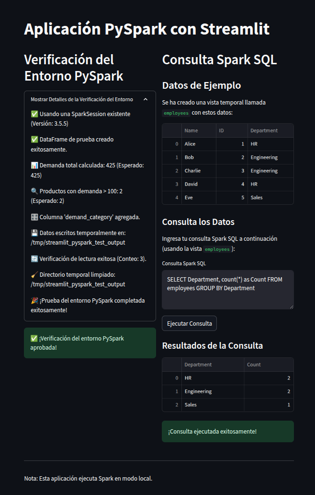

# 🐳 Docker-Python-Environments 🐳

## Ejemplo de aplicación en PySpark con Streamlit

Este repositorio incluye una aplicación de ejemplo que demuestra el uso práctico de Docker con Python, PySpark y Streamlit. La aplicación está configurada para ejecutarse fácilmente usando Docker Compose y basada en una imagen con `spark` ya configurada.

### Estructura del proyecto de ejemplo

```
app.py                # Aplicación Streamlit con PySpark
docker-compose.yml    # Configuración para desplegar la aplicación
Dockerfile            # Imagen Docker para la aplicación
environment.yml       # Dependencias de Conda para el proyecto
```

### Características de la aplicación

- **Verificación del entorno PySpark**: Comprueba que PySpark funciona correctamente
- **Consultas SQL interactivas**: Permite ejecutar consultas Spark SQL desde la interfaz web
- **Visualización de datos**: Muestra resultados en tablas interactivas

### Vista previa de la aplicación



### Cómo ejecutar la aplicación

1. **Usando Docker Compose** (recomendado):

   ```bash
   docker-compose up --build
   ```

   La aplicación estará disponible en: http://localhost:8501

2. **Construyendo manualmente**:

   ```bash
   # Construir la imagen
   docker build -t my-project-sol .
   
   # Ejecutar el contenedor
   docker run -it --rm -p 8501:8501 -p 4040:4040 -v "$(pwd)":/my-project-dir -w /my-project-dir my-project-sol bash -lc "streamlit run app.py"
   ```

### Detalles del Dockerfile

El Dockerfile principal utiliza la imagen base `lacamposm/docker-helpers:pyspark-conda-0.1.1` que incluye Python, Conda y PySpark preconfigurados. La aplicación se ejecuta en un entorno Conda definido en `environment.yml`.

### Estructura de docker-compose.yml

El archivo docker-compose.yml configura:
- Construcción automática de la imagen
- Mapeo de puertos (8501 para Streamlit, 4040 para la UI de Spark)
- Montaje de volúmenes para el código fuente
- Variables de entorno necesarias
- Comando para iniciar la aplicación Streamlit

---

# 🐳 Docker Multitask Python Environments - Guía Completa 🐳

## Tabla de Contenidos
- [Introducción](#introducción)
  - [¿Qué es Docker?](#qué-es-docker)
  - [¿Qué es Python?](#qué-es-python)
  - [Python y Docker](#python-y-docker)
- [¿Por qué usar Docker?](#por-qué-usar-docker)
- [Conceptos Clave](#conceptos-clave)
- [Principales Comandos de Docker](#principales-comandos-de-docker)
  - [Comandos Detallados](#comandos-detallados)
- [Imágenes disponibles y uso](#imágenes-disponibles-y-uso)
  - [Python Minimal (3.12-slim)](#dockerfile-pythonmin)
  - [Python Conda](#dockerfile-pythonconda)
  - [Python Conda Dev](#dockerfile-pythoncondasev)
  - [Python Poetry](#dockerfile-pythonpoetry)
  - [Python Poetry Dev](#dockerfile-poetrydev)
  - [Python Spark](#dockerfile-pythonspark)
- [Usos de Docker en Python](#usos-de-docker-en-python)
- [Desarrollo con VS Code DevContainer](#desarrollo-con-vs-code-devcontainer)
- [Publicación de imágenes en Docker Hub](#publicar-la-imagen-en-docker-hub)
- [Recomendaciones](#recomendaciones-al-trabajar-con-docker-y-python)
- [Conclusión](#conclusión)


### ¿Qué es Docker?

Docker es una plataforma que permite desarrollar, enviar y ejecutar aplicaciones dentro de contenedores. Un contenedor es un entorno ligero y aislado que contiene todo lo necesario para que una aplicación funcione de forma consistente en cualquier lugar.

### ¿Qué es Python?

Python es un lenguaje de programación interpretado, de alto nivel y propósito general conocido por su legibilidad y versatilidad. Su filosofía de diseño enfatiza la simplicidad y la legibilidad del código, lo que permite a los desarrolladores expresar conceptos en menos líneas que en otros lenguajes. Python es ampliamente utilizado en análisis de datos, inteligencia artificial, desarrollo web, automatización, y prácticamente en cualquier campo de la programación.

### Python y Docker

La combinación de Python y Docker resuelve muchos desafíos comunes en el desarrollo de software. Python, con su diversidad de versiones y dependencias, a menudo enfrenta el problema de "funciona en mi máquina". Docker soluciona esto al empaquetar la aplicación Python junto con todas sus dependencias en un contenedor, asegurando un comportamiento uniforme en diferentes entornos. Esta combinación es particularmente valiosa para equipos que trabajan en proyectos científicos o soluciones de analitica de datos, donde la consistencia del entorno es crucial para obtener resultados reproducibles.

## ¿Por qué usar Docker?

- **Aislamiento**: Cada contenedor cuenta con sus propias dependencias y librerías, evitando conflictos con otras aplicaciones.  
- **Reproducibilidad**: Las aplicaciones se ejecutan de la misma manera indistintamente del sistema operativo anfitrión.  
- **Escalabilidad**: Es sencillo replicar un contenedor y desplegarlo en distintos entornos sin configuraciones extra.  
- **Portabilidad**: Se puede exportar e importar contenedores sin importar la infraestructura subyacente.

## Conceptos Clave

- **Imagen**: Conjunto de capas que incluyen el sistema de archivos y la configuración necesarios para ejecutar un contenedor.  
- **Contenedor**: Instancia de una imagen que se ejecuta de forma aislada y que puede crearse, iniciarse o detenerse fácilmente.  
- **Dockerfile**: Archivo que describe paso a paso cómo se construye una imagen (instrucciones sobre instalación de paquetes y configuraciones).  
- **Registro de imágenes**: Repositorio donde se almacenan y comparten imágenes de Docker (ej. Docker Hub).  

## Principales Comandos de Docker

Los comandos esenciales para trabajar con Docker son:

- `docker pull <imagen>`: Descarga una imagen desde un registro.
- `docker run <imagen>`: Crea y ejecuta un contenedor basado en la imagen.
- `docker ps`: Lista los contenedores en ejecución.
- `docker stop <contenedor>`: Detiene un contenedor en ejecución.
- `docker rm <contenedor>`: Elimina un contenedor detenido.
- `docker build -t <nombre_imagen> .`: Construye una imagen desde un Dockerfile.

### Comandos Detallados

1. `docker pull <imagen>`
    Descarga una imagen desde un registro.
    - `--all-tags, -a`: Descarga todas las etiquetas disponibles de la imagen.

2. `docker run <imagen>`
    Crea y ejecuta un contenedor basado en la imagen indicada.
    - `--detach, -d`: Ejecuta el contenedor en segundo plano.
    - `-it`: Permite una terminal interactiva.
    - `--volume, -v`: Monta un volumen.
    - `--name`: Asigna un nombre personalizado al contenedor.
    - `--rm`: Elimina automáticamente el contenedor cuando se detiene.

3. `docker ps`
    Lista los contenedores en ejecución.
    - `--all, -a`: Muestra todos los contenedores (no solo los activos).

4. `docker stop <contenedor>`
    Detiene un contenedor en ejecución.
    - `--time, -t`: Segundos a esperar antes de forzar la detención.

5. `docker rm <contenedor>`
    Elimina un contenedor que ya se ha detenido.
    - `--force, -f`: Fuerza la eliminación de un contenedor en ejecución.

6. `docker build -t <nombre_imagen> .`
    Construye una imagen usando un Dockerfile presente en el directorio actual.
    - `--no-cache`: No usa la caché durante la construcción.
    - `--file, -f`: Nombre del Dockerfile (por defecto es 'Dockerfile').

## Imágenes disponibles y uso

### python-min/Dockerfile

Imagen mínima de Python 3.12 para entornos ligeros sin paquetes adicionales.
Esta imagen se utiliza cuando se requiere un entorno base de Python sin dependencias extras, ideal para ejecutar scripts o aplicaciones simples de manera eficiente sin sobrecargar el contenedor.

```dockerfile
FROM python:3.12-slim

#  Set working directory for better layer caching
WORKDIR /workspace

#  Copy only requirements to cache dependencies layer
COPY requirements.txt .

#  Create venv, install dependencies, register kernel, 
# configure bashrc, and clean up in one layer
RUN set -eux; \
    python -m venv /opt/venv; \
    # ensure the virtualenv is activated in interactive shells
    echo 'source /opt/venv/bin/activate' >> /root/.bashrc; \
    /opt/venv/bin/pip install --no-cache-dir --upgrade pip; \
    /opt/venv/bin/pip install --no-cache-dir -r requirements.txt; \
    rm requirements.txt; \
    # register this environment as a Jupyter kernel
    /opt/venv/bin/python -m ipykernel install --sys-prefix --name venv --display-name "Python3.12 (venv)"

#  Prepend venv to PATH and ensure bash sources bashrc in non-interactive mode
ENV PATH="/opt/venv/bin:$PATH" \
    BASH_ENV="/root/.bashrc"

#  Expose Jupyter Notebook port
EXPOSE 8888

#  Launch bash (venv will be active via bashrc)
CMD ["bash"]
```

El archivo `requirements.txt` incluye:

```
jupyter
ipykernel
```

#### Ejecutar y Crear el Contenedor

Estando en la carpeta padre del proyecto:

##### Linux/MacOS


1. Construir la imagen de Docker:

     ```bash
     docker build -t python3.12-slim -f ./python-min/Dockerfile .
     ```

3. Ejecutar el contenedor montando la carpeta actual como volumen:
     ```sh
     docker run -it --rm -v "$(pwd)":/$(basename "$(pwd)") -w /$(basename "$(pwd)") python3.12-slim:latest
     ```

##### Windows

1. Construir la imagen de Docker:
     ```sh
     docker build -t python3.12-slim -f .\python-min\Dockerfile .
     ```
3. Ejecutar el contenedor montando la carpeta actual como volumen:

     ```powershell
     docker run -it --rm -v "${PWD}:/$(Split-Path -Leaf $PWD)" -w "/$(Split-Path -Leaf $PWD)" python3.12-slim:latest
     ```

     O en una línea más legible usando el caracter de continuación ` :
     ```powershell
     docker run -it --rm `
          -v "${PWD}:/$(Split-Path -Leaf $PWD)" `
          -w "/$(Split-Path -Leaf $PWD)" `
          python3.12-slim:latest
     ```

### conda/Dockerfile

Imagen basada en Miniconda para entornos de desarrollo científico.

```dockerfile
FROM continuumio/miniconda3:24.10.0-1

LABEL maintainer="lacamposm <lacamposm@unal.edu.co>" \
      version="0.1.1" \
      description="Python 3.11 with conda for base image analytic projects"

RUN apt-get update && apt-get install -y --no-install-recommends \
    bash \
    build-essential \
    ca-certificates \
    curl \
    libnss3 \
    make \
    sudo \
    wget \
    && apt-get clean \
    && rm -rf /var/lib/apt/lists/*

CMD ["/bin/bash"]
```

#### Ejecutar y Crear el Contenedor

Estando en la carpeta padre del proyecto:

##### Linux/MacOS

1. Construir la imagen de Docker:
     ```sh
     docker build -t python-conda -f ./conda/Dockerfile .
     ```

2. Ejecutar el contenedor montando la carpeta actual como volumen:
     ```sh
     docker run -it --rm -v "$(pwd)":/$(basename "$(pwd)") -w /$(basename "$(pwd)") python-conda:latest
     ```

##### Windows

1. Construir la imagen de Docker:
     ```powershell
     docker build -t python-conda -f .\conda\Dockerfile .
     ```

2. Ejecutar el contenedor montando la carpeta actual como volumen:
     ```powershell
     docker run -it --rm `
     -v "${PWD}:/$(Split-Path -Leaf $PWD)" `
     -w "/$(Split-Path -Leaf $PWD)" `
     python-conda:latest
     ```

### conda/Dockerfile.dev

Versión extendida para desarrollo con Node.js y otras herramientas adicionales.

```dockerfile
# Imagen base misma que en latest de conda/Dockerfile
FROM continuumio/miniconda3:24.10.0-1

LABEL maintainer="lacamposm <lacamposm@unal.edu.co>" \
      version="0.1.1" \
      description="Python 3.11 with conda for base image dev-version"

# Actualizar repositorios e instalar utilidades esenciales para desarrollo
RUN apt-get update && apt-get install -y --no-install-recommends \
    bash \
    build-essential \
    ca-certificates \
    curl \
    git \
    libnss3 \
    make \
    sudo \
    wget \
    && curl -fsSL https://deb.nodesource.com/setup_20.x | bash - \
    && apt-get update && apt-get install -y --no-install-recommends nodejs \
    && node -v && npm -v \
    && git config --system core.sshCommand "ssh -o UserKnownHostsFile=/dev/null -o StrictHostKeyChecking=no" \
    && git config --system --add safe.directory "*" \
    && apt-get clean && rm -rf /var/lib/apt/lists/*

CMD ["/bin/bash"]
```

#### Ejecutar y Crear el Contenedor

##### Linux/MacOS

1. Construir la imagen de Docker:
     ```sh
     docker build -t python-conda-dev -f ./conda/Dockerfile.dev .
     ```

2. Ejecutar el contenedor montando la carpeta actual como volumen:
     ```sh
     docker run -it --rm -v "$(pwd)":/$(basename "$(pwd)") -w /$(basename "$(pwd)") python-conda-dev:latest
     ```

##### Windows

1. Construir la imagen de Docker:
     ```powershell
     docker build -t python-conda-dev -f .\conda\Dockerfile.dev .
     ```

2. Ejecutar el contenedor montando la carpeta actual como volumen:
     ```powershell
     docker run -it --rm `
     -v "${PWD}:/$(Split-Path -Leaf $PWD)" `
     -w "/$(Split-Path -Leaf $PWD)" `
     python-conda-dev:latest
     ```

### poetry/Dockerfile

Imagen básica con Python 3.12-slim y Poetry para gestión de dependencias.

```dockerfile
FROM python:3.12.10

LABEL maintainer="lacamposm <lacamposm@unal.edu.co>" \
      version="0.1.1" \
      description="Python 3.12.10 + Poetry"

ENV POETRY_HOME="/opt/poetry"
ENV PATH="${POETRY_HOME}/bin:${PATH}"

RUN apt-get update \
    && apt-get install -y --no-install-recommends \
    bash build-essential ca-certificates curl git make wget \
    && rm -rf /var/lib/apt/lists/* \
    && pip install --no-cache-dir --upgrade pip --root-user-action=ignore \
    && curl -sSL https://install.python-poetry.org | python3 - \
    && poetry config virtualenvs.create false \
    && rm -rf /root/.cache/pypoetry/*

CMD ["/bin/bash"]
```

#### Ejecutar y Crear el Contenedor

Estando en la carpeta padre del proyecto:

##### Linux/MacOS

1. Construir la imagen de Docker:
     ```sh
     docker build -t python-poetry -f ./poetry/Dockerfile .
     ```

2. Ejecutar el contenedor montando la carpeta actual como volumen:
     ```sh
     docker run -it --rm -v "$(pwd)":/$(basename "$(pwd)") -w /$(basename "$(pwd)") python-poetry:latest
     ```

##### Windows

1. Construir la imagen de Docker:
     ```powershell
     docker build -t python-poetry -f .\poetry\Dockerfile .
     ```

2. Ejecutar el contenedor montando la carpeta actual como volumen:
     ```powershell
     docker run -it --rm `
     -v "${PWD}:/$(Split-Path -Leaf $PWD)" `
     -w "/$(Split-Path -Leaf $PWD)" `
     python-poetry:latest
     ```

### spark/Dockerfile

Imagen con Python Conda y Apache Spark para procesamiento de datos distribuido.

```dockerfile
# Use the same base image as the main Dockerfile
# For more information:
#   - https://hub.docker.com/r/lacamposm/docker-helpers
#   - https://github.com/lacamposm/desarrollo-analitico-oic
FROM lacamposm/docker-helpers:python-conda-base-0.1.1

LABEL maintainer="lacamposm <lacamposm@unal.edu.co>" \
      version="0.1.1" \
      description="Python 3.12.10 + Spark 3.5.5"

# Install dependencies, configure system, and setup directories in a single layer
# to reduce image size and number of layers  
RUN mkdir -p /my-project-dir /data/_tmp && \
    chmod -R 777 /data/_tmp && \
    apt-get update && \
    apt-get install -y --no-install-recommends \
        bash-completion \
        locales \
        openjdk-17-jre-headless && \
    rm -rf /var/lib/apt/lists/* && \
    wget -q https://archive.apache.org/dist/spark/spark-3.5.5/spark-3.5.5-bin-hadoop3.tgz && \
    tar -xzf spark-3.5.5-bin-hadoop3.tgz && \
    mv spark-3.5.5-bin-hadoop3 /opt/spark && \
    rm spark-3.5.5-bin-hadoop3.tgz && \
    rm -rf /tmp/* /root/.cache /root/.wget-hsts

# Configure environment variables.
ENV SPARK_HOME=/opt/spark
ENV PATH=$PATH:$SPARK_HOME/bin:$SPARK_HOME/sbin
ENV JAVA_HOME=/usr/lib/jvm/java-17-openjdk-amd64
ENV PATH=$JAVA_HOME/bin:$PATH

# Expose ports for Spark UI, FastAPI, Streamlit, Jupyter
EXPOSE 4040 8000 8501 8888

CMD ["/bin/bash"]
```

### spark/Dockerfile.dev

Versión extendida para desarrollo con herramientas adicionales y base en python-conda-dev.

```dockerfile
# Use the same base image as the main Dockerfile
# For more information:
#   - https://hub.docker.com/r/lacamposm/docker-helpers
#   - https://github.com/lacamposm/desarrollo-analitico-oic
FROM lacamposm/docker-helpers:python-conda-base-0.1.1-dev

LABEL maintainer="lacamposm <lacamposm@unal.edu.co>" \
      version="0.1.1" \
      description="Python 3.12.10 + Spark 3.5.5, dev-version"

# Install dependencies, configure system, and setup directories in a single layer
# to reduce image size and number of layers  
RUN mkdir -p /my-project-dir /data/_tmp && \
    chmod -R 777 /data/_tmp && \
    apt-get update && \
    apt-get install -y --no-install-recommends \
        bash-completion \
        locales \
        openjdk-17-jre-headless && \
    rm -rf /var/lib/apt/lists/* && \
    wget -q https://archive.apache.org/dist/spark/spark-3.5.5/spark-3.5.5-bin-hadoop3.tgz && \
    tar -xzf spark-3.5.5-bin-hadoop3.tgz && \
    mv spark-3.5.5-bin-hadoop3 /opt/spark && \
    rm spark-3.5.5-bin-hadoop3.tgz && \
    rm -rf /tmp/* /root/.cache /root/.wget-hsts

# Configure environment variables.
ENV SPARK_HOME=/opt/spark
ENV PATH=$PATH:$SPARK_HOME/bin:$SPARK_HOME/sbin
ENV JAVA_HOME=/usr/lib/jvm/java-17-openjdk-amd64
ENV PATH=$JAVA_HOME/bin:$PATH

# Expose ports for Spark UI, FastAPI, Streamlit, Jupyter
EXPOSE 4040 8000 8501 8888

CMD ["/bin/bash"]
```

#### Ejecutar y Crear el Contenedor

Estando en la carpeta padre del proyecto:

##### Linux/MacOS

1. Construir la imagen de Docker:
     ```sh
     docker build -t python-spark -f ./spark/Dockerfile .
     ```

2. Ejecutar el contenedor montando la carpeta actual como volumen:
     ```sh
     docker run -it --rm -v "$(pwd)":/$(basename "$(pwd)") -w /$(basename "$(pwd)") python-spark:latest
     ```

3. Para la versión de desarrollo:
     ```sh
     docker build -t python-spark-dev -f ./spark/Dockerfile.dev .
     docker run -it --rm -v "$(pwd)":/$(basename "$(pwd)") -w /$(basename "$(pwd)") python-spark-dev:latest
     ```

##### Windows

1. Construir la imagen de Docker:
     ```powershell
     docker build -t python-spark -f .\spark\Dockerfile .
     ```

2. Ejecutar el contenedor montando la carpeta actual como volumen:
     ```powershell
     docker run -it --rm `
     -v "${PWD}:/$(Split-Path -Leaf $PWD)" `
     -w "/$(Split-Path -Leaf $PWD)" `
     python-spark:latest
     ```

3. Para la versión de desarrollo:
     ```powershell
     docker build -t python-spark-dev -f .\spark\Dockerfile.dev .
     docker run -it --rm `
     -v "${PWD}:/$(Split-Path -Leaf $PWD)" `
     -w "/$(Split-Path -Leaf $PWD)" `
     python-spark-dev:latest
     ```

## Usos de Docker en Python

- **Entornos de desarrollo**: Facilita la creación de entornos personalizados que incluyan la versión de Python y las dependencias necesarias para cada proyecto.  
- **Pruebas y validación**: Se pueden ejecutar tests en contenedores limpios, reproduciendo condiciones idénticas sin afectar la configuración del sistema local.  
- **Despliegue en producción**: Una vez validada la aplicación, se despliega el mismo contenedor en el entorno de producción, lo que reduce los errores por diferencias de configuración.  

## Desarrollo con VS Code DevContainer

Para facilitar el desarrollo aislado con VS Code, se provee un DevContainer configurado en la carpeta `.devcontainer`:

1.  **Construir y levantar** el contenedor con Docker Compose:

    ```sh
    docker compose -f .devcontainer/docker-compose-dev.yml up --build
    ```

2.  **Contexto y Dockerfile** usados:
    *   Contexto: `.` (directorio raíz del proyecto)
    *   Dockerfile: `.devcontainer/Dockerfile.dev`
    *   Archivo de entorno: `.devcontainer/environment.dev.yml`

3.  **Acceder** al contenedor:
    ```sh
    docker exec -it dev-name-project bash
    ```

4.  **Reabrir en contenedor** desde VS Code (guía rápida):
    *   Ctrl+Shift+P → _Dev Containers: Rebuild and Reopen in Container_

**➡️ Para más detalles sobre la configuración del Dev Container, consulta el [README específico de .devcontainer](./.devcontainer/README.md).**

## Publicar la Imagen en Docker Hub

Para publicar las imágenes en Docker Hub, sigue estos pasos:

1. Inicia sesión en Docker Hub:
     ```sh
     docker login
     ```
     Ingresa tu nombre de usuario y contraseña cuando se solicite.

2. Etiquetar las imágenes
   Para subir una imagen a tu repositorio en Docker Hub, primero debes etiquetarla con tu nombre de usuario:

     Para PythonMin:
     ```sh
     docker tag python3.12-slim tu-usuario-dockerhub/nombre-asignado:python3.12-slim
     ```
     Para PythonConda:
     ```sh
     docker tag python-conda tu-usuario-dockerhub/nombre-asignado:python-conda
     ```
     Para PythonCondaDev:
     ```sh
     docker tag python-conda-dev tu-usuario-dockerhub/nombre-asignado:python-conda-dev
     ```
     Para PythonPoetry:
     ```sh
     docker tag python-poetry tu-usuario-dockerhub/nombre-asignado:python-poetry
     ```
     Para PythonSpark:
     ```sh
     docker tag python-spark tu-usuario-dockerhub/nombre-asignado:python-spark
     ```

3. Subir las imágenes a Docker Hub
   Una vez etiquetadas, puedes subirlas a Docker Hub:

     Para PythonMin:
     ```sh
     docker push tu-usuario-dockerhub/nombre-asignado:python3.12-slim
     ```
     Para PythonConda:
     ```sh
     docker push tu-usuario-dockerhub/nombre-asignado:python-conda
     ```
     Para PythonCondaDev:
     ```sh
     docker push tu-usuario-dockerhub/nombre-asignado:python-conda-dev
     ```
     Para PythonPoetry:
     ```sh
     docker push tu-usuario-dockerhub/nombre-asignado:python-poetry
     ```
     Para PythonSpark:
     ```sh
     docker push tu-usuario-dockerhub/nombre-asignado:python-spark
     ```

4. Descargar y utilizar imágenes desde Docker Hub
   Para descargar y usar una imagen publicada:

     ```sh
     docker pull tu-usuario-dockerhub/nombre-asignado:python-conda-dev
     ```

     Para Linux:
     ```sh
     docker run -it --rm -v "$(pwd)":/$(basename "$(pwd)") -w /$(basename "$(pwd)") tu-usuario-dockerhub/nombre-asignado:python-conda-dev
     ```

     Para Windows:
     ```powershell
     docker run -it --rm -v "${PWD}:/$(Split-Path -Leaf $PWD)" -w "/$(Split-Path -Leaf $PWD)" tu-usuario-dockerhub/nombre-asignado:python-conda-dev
     ```

     Asegúrate de reemplazar `tu-usuario-dockerhub` con tu nombre de usuario en Docker Hub si estás subiendo tus propias imágenes.

5. Explicación de los parámetros
     - `-it`: Permite la interacción con el contenedor.
     - `--rm`: Elimina el contenedor al detenerse.
     - `-v "$(pwd):/$(basename "$(pwd)")"`: Monta el directorio actual en el contenedor.
     - `-w /$(basename "$(pwd)")"`: Define el directorio de trabajo.

## Recomendaciones al Trabajar con Docker y Python

- Incluir siempre un archivo con las dependencias (por ejemplo, `requirements.txt`, `pyproject.toml` o `environment.yml` para Conda) para que la instalación sea clara y reproducible.
- Considerar Conda como alternativa para gestionar entornos Python dentro de contenedores, especialmente para proyectos científicos o con dependencias complejas.
- Al usar Conda con Docker, preferir imágenes base como `continuumio/miniconda3` que ya incluyen el sistema de gestión de paquetes preinstalado.  
- Mantener las imágenes lo más ligeras posible para disminuir tiempos de descarga y consumo de recursos.  
- Usar herramientas de orquestación como Docker Compose o Kubernetes para coordinar varios contenedores (ej. bases de datos, servidores web, etc.).  

## Conclusión

Docker ha transformado radicalmente la forma en que desarrollamos, probamos y desplegamos aplicaciones, tanto en Python como en otros lenguajes. Al encapsular cada entorno en contenedores, se garantiza una ejecución uniforme y predecible en cualquier plataforma, eliminando de raíz el clásico problema de "en mi máquina funciona". 

### Ventajas Destacadas

- **Uniformidad**: Garantiza ejecución idéntica en cualquier plataforma, simplificando la depuración.
- **Eficiencia**: Contenedores más ligeros y rápidos que máquinas virtuales, optimizando recursos.
- **CI/CD**: Integración fluida con pipelines de desarrollo automatizado.
- **Microservicios**: Facilita arquitecturas modulares con componentes independientes.
- **Persistencia**: Mediante volúmenes, separa código inmutable de datos persistentes.

Para los desarrolladores de Python, Docker no solo resuelve problemas históricos relacionados con la gestión de versiones y conflictos de dependencias, sino que establece un flujo de trabajo moderno y robusto. En un mundo cada vez más orientado hacia infraestructuras cloud-native y metodologías ágiles, Docker se consolida como una herramienta esencial en el ecosistema DevOps, facilitando procesos de desarrollo más eficientes, colaborativos y escalables.